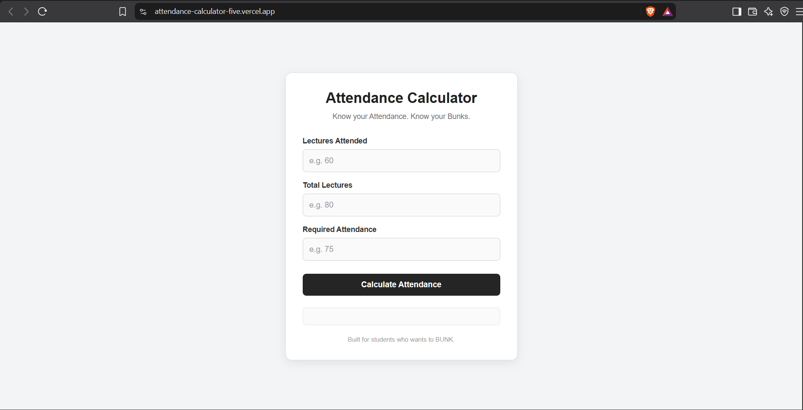

# Attendance Calculator

A calculator for calculating attendance and bunks.

## Description

An attendance calculator in which you just enter number of lectures you have attended and total number of lectures held. The website will calculate your attendance and will also give you the number of lectures you can bunk to maintain a specific percentage of attendance.

## Screenshots

## How to Run it locally

1. Clone this repository or download the ZIP file.
2. Open the project folder.
3. Open `index.html` in your browser.
4. The Attendance Calculator will run directly in the browser.

## How to Use

1. Enter number of lectures attended.
2. Enter number of total lectures held.
3. Enter percentage of attendance you want to maintain.
4. Click "Calculate Attendance".
5. The website gives you:
   - Attendance in percentage.
   - If your attendance is below required attendance, it gives you the amount of lectures you need to attend to achieve the desired attendance.
   - If your attendance is above required attendance, it gives you the number of lectures you can bunk to maintain that much attendance.

## Tech Stack

1. HTML
2. CSS
3. JavaScript

## AI Assistance

AI assistance was used for parts of the CSS development.

- I wrote the HTML structure and JavaScript logic myself.
- AI helped me with CSS suggestions for layout, spacing, colors, input styling, buttons, and responsiveness.
- I manually added, tested, and modified the CSS in my project.
- AI was also used for debugging and understanding some CSS issues.